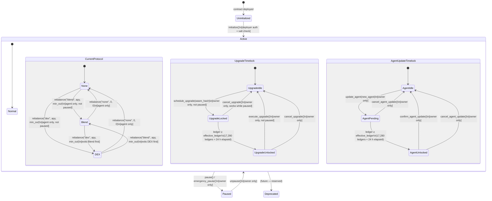
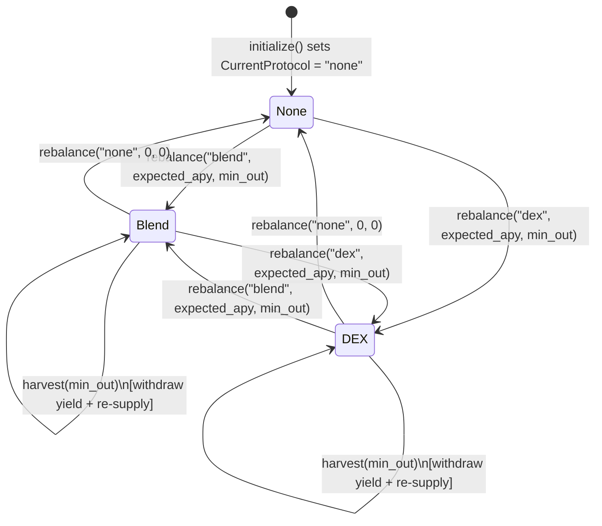
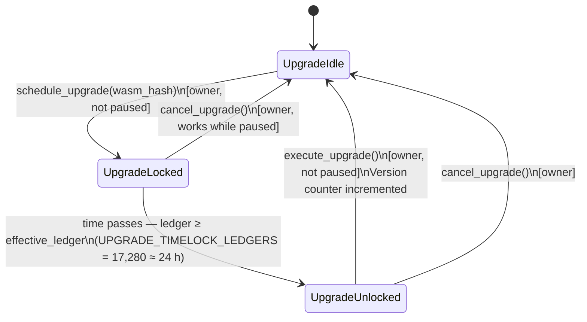
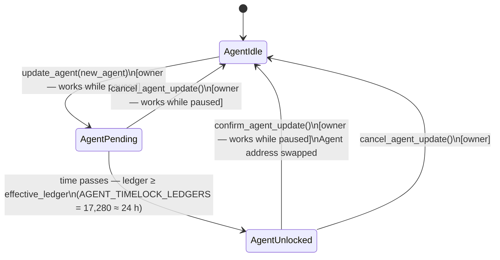

# NeuroWealth Vault — State Machine Documentation

> Last verified against `neurowealth-vault/contracts/vault/src/lib.rs` on 2026-09-24.

This document describes the complete lifecycle of the NeuroWealth Vault smart contract,
covering all operating states, sub-states, transitions, preconditions, and postconditions.

---

## Top-Level State Diagram



---

## States

### Uninitialized

The contract has been deployed to the network but `initialize()` has not yet been called.

- No functions other than `initialize()` will succeed.
- This state is entered exactly once and never re-entered.

### Active

Normal operating state. Deposits, withdrawals, and rebalances are all available
(subject to per-function access control and rate limits).

Active is a composite state with three concurrent sub-machines:

| Sub-machine | Tracks |
|-------------|--------|
| **CurrentProtocol** | Where idle USDC is deployed (none / blend / dex) |
| **UpgradeTimelock** | Whether a WASM upgrade is pending and when it unlocks |
| **AgentUpdateTimelock** | Whether an agent rotation is pending and when it unlocks |

### Paused

Emergency stop. No deposits, withdrawals, rebalances, or harvests can execute.
Owner recovery actions (cancel_upgrade, cancel_agent_update, pool reconfiguration,
ownership transfer) continue to work. See
[SECURITY.md — Pause-Semantics Matrix](../SECURITY.md#pause-semantics-matrix) for the
exhaustive list.

### Deprecated

Reserved for a future two-step migration path (not yet implemented).

---

## Sub-State: CurrentProtocol

The `CurrentProtocol` sub-state tracks where the vault's USDC is deployed at
any given time. Only the AI agent may trigger transitions via `rebalance()`.



| State | Meaning |
|-------|---------|
| `none` | All USDC held idle in the vault contract; no external protocol involved |
| `blend` | USDC supplied to the configured Blend lending pool |
| `dex` | USDC added as liquidity to the configured DEX pool |

**Notes:**
- `harvest()` does not change `CurrentProtocol`; it withdraws accrued yield from the
  active protocol and immediately re-supplies it.
- A cross-protocol rebalance (e.g. `blend` → `dex`) first withdraws all assets from
  the current protocol, then supplies them to the new one. Both legs must succeed
  or the transaction reverts.
- `rebalance()` with the same protocol as already active and no idle USDC returns
  a `status: "noop"` event without moving funds.

---

## Sub-State: UpgradeTimelock

Tracks the two-step WASM upgrade process introduced in Issue #316.



| State | DataKey::PendingUpgrade | Description |
|-------|-------------------------|-------------|
| `UpgradeIdle` | `None` | No upgrade in progress |
| `UpgradeLocked` | `Some((wasm_hash, effective_ledger))` | Upgrade proposed; timelock not yet elapsed |
| `UpgradeUnlocked` | `Some((wasm_hash, effective_ledger))` | Timelock elapsed; ready to execute |

`get_pending_upgrade()` returns `Some((wasm_hash, effective_ledger))` in `UpgradeLocked`
and `UpgradeUnlocked` states, and `None` in `UpgradeIdle`.

---

## Sub-State: AgentUpdateTimelock

Tracks the two-step AI agent rotation process introduced in Issue #317.



| State | DataKey::PendingAgentUpdate | Description |
|-------|------------------------------|-------------|
| `AgentIdle` | `None` | No agent rotation in progress; active agent is the confirmed one |
| `AgentPending` | `Some((pending_agent, effective_ledger))` | Rotation proposed; old agent still active |
| `AgentUnlocked` | `Some((pending_agent, effective_ledger))` | Timelock elapsed; ready to confirm |

`get_pending_agent_update()` returns `Some((pending_agent, effective_ledger))` while a
rotation is pending, `None` otherwise.

---

## State Transition Table

### Top-Level Transitions

| From | To | Trigger | Who | Preconditions | Postconditions |
|------|----|---------|-----|---------------|----------------|
| Uninitialized | Active | `initialize(deployer, owner, agent, usdc_token, salt)` | Deployer | Contract not yet initialized; `deployer` reproduces contract address with `salt`; deployer auth present | Owner, Agent, UsdcToken stored; `CurrentProtocol = "none"`; `Paused = false`; `Version = 0` |
| Active | Paused | `pause()` | Owner | Not paused | `Paused = true`; `PausedEvent` emitted |
| Active | Paused | `emergency_pause()` | Owner | (idempotent — can re-pause) | `Paused = true`; `PausedEvent` emitted |
| Paused | Active | `unpause()` | Owner | Is paused | `Paused = false`; `UnpausedEvent` emitted |

### CurrentProtocol Transitions

| From | To | Trigger | Who | Preconditions | Postconditions |
|------|----|---------|-----|---------------|----------------|
| `none` | `blend` | `rebalance("blend", apy, min_out)` | Agent | Not paused; `BlendPool` configured; `min_out ≥ 0`; rebalance cooldown elapsed | USDC supplied to Blend; `CurrentProtocol = "blend"`; `RebalanceEvent` + `ProtocolChangedEvent` emitted |
| `none` | `dex` | `rebalance("dex", apy, min_out)` | Agent | Not paused; `DexPool` configured; `min_out ≥ 0`; cooldown elapsed | USDC added to DEX; `CurrentProtocol = "dex"`; events emitted |
| `blend` | `none` | `rebalance("none", 0, 0)` | Agent | Not paused; cooldown elapsed | Full Blend withdrawal; `CurrentProtocol = "none"`; events emitted |
| `blend` | `dex` | `rebalance("dex", apy, min_out)` | Agent | Not paused; `DexPool` configured; cooldown elapsed | Blend withdrawn first, then DEX supplied; `CurrentProtocol = "dex"`; events emitted |
| `dex` | `none` | `rebalance("none", 0, 0)` | Agent | Not paused; cooldown elapsed | Full DEX withdrawal; `CurrentProtocol = "none"`; events emitted |
| `dex` | `blend` | `rebalance("blend", apy, min_out)` | Agent | Not paused; `BlendPool` configured; cooldown elapsed | DEX withdrawn first, then Blend supplied; `CurrentProtocol = "blend"`; events emitted |
| `blend` | `blend` | `harvest(min_out)` | Agent | Not paused; `CurrentProtocol = "blend"` | Yield withdrawn and re-supplied; `HarvestEvent` emitted; `CurrentProtocol` unchanged |
| `dex` | `dex` | `harvest(min_out)` | Agent | Not paused; `CurrentProtocol = "dex"` | Yield withdrawn and re-supplied; `HarvestEvent` emitted; `CurrentProtocol` unchanged |

### UpgradeTimelock Transitions

| From | To | Trigger | Who | Preconditions | Postconditions |
|------|----|---------|-----|---------------|----------------|
| `UpgradeIdle` | `UpgradeLocked` | `schedule_upgrade(wasm_hash)` | Owner | Not paused; no upgrade pending | `DataKey::PendingUpgrade = Some((wasm_hash, current_ledger + 17_280))`; `UpgradeScheduledEvent` emitted |
| `UpgradeLocked` | `UpgradeUnlocked` | Time passage | — | `env.ledger().sequence() ≥ effective_ledger` | No on-chain action; state observable via `get_pending_upgrade()` |
| `UpgradeUnlocked` | `UpgradeIdle` | `execute_upgrade()` | Owner | Not paused; timelock elapsed | WASM replaced; `Version` incremented; `PendingUpgrade` cleared; `UpgradeExecutedEvent` emitted |
| `UpgradeLocked` | `UpgradeIdle` | `cancel_upgrade()` | Owner | Can be paused | `PendingUpgrade` cleared; `UpgradeCancelledEvent` emitted |
| `UpgradeUnlocked` | `UpgradeIdle` | `cancel_upgrade()` | Owner | — | `PendingUpgrade` cleared; `UpgradeCancelledEvent` emitted |

### AgentUpdateTimelock Transitions

| From | To | Trigger | Who | Preconditions | Postconditions |
|------|----|---------|-----|---------------|----------------|
| `AgentIdle` | `AgentPending` | `update_agent(new_agent)` | Owner | Works while paused | `DataKey::PendingAgentUpdate = Some((new_agent, current_ledger + 17_280))`; `AgentUpdateScheduledEvent` emitted |
| `AgentPending` | `AgentUnlocked` | Time passage | — | `env.ledger().sequence() ≥ effective_ledger` | No on-chain action |
| `AgentUnlocked` | `AgentIdle` | `confirm_agent_update()` | Owner | Works while paused; timelock elapsed | `Agent` storage updated; `PendingAgentUpdate` cleared; `AgentUpdatedEvent` emitted |
| `AgentPending` | `AgentIdle` | `cancel_agent_update()` | Owner | Works while paused | `PendingAgentUpdate` cleared; `AgentUpdateCancelledEvent` emitted |
| `AgentUnlocked` | `AgentIdle` | `cancel_agent_update()` | Owner | — | `PendingAgentUpdate` cleared; `AgentUpdateCancelledEvent` emitted |

---

## Flash-Loan Protection Gate

The vault enforces a per-user minimum holding period (`MinHoldingPeriod` in ledgers,
configurable by the owner). This is not a separate top-level state but an invariant
checked on every `withdraw()` / `withdraw_all()` call.

```
withdraw(user, amount)
  ├─ If MinHoldingPeriod == 0  → allow (protection disabled)
  └─ If env.ledger().sequence() - LastDepositLedger(user) < MinHoldingPeriod
       → panic VaultError::HoldingPeriodNotElapsed (#75)
          + emit FlashLoanProtectionTriggeredEvent (topic: fl_block)
```

---

## What Was Wrong With the Previous Diagram

The previous version of this document modelled `Rebalancing` as a top-level peer
state to `Active` and `Paused`. This was inaccurate for two reasons:

1. **Rebalancing is not a blocking state.** The vault contract is stateless between
   transactions. There is no in-progress rebalance state stored on-chain; each
   `rebalance()` call is an atomic transaction.
2. **`CurrentProtocol` is the persistent sub-state.** What the previous diagram called
   `Idle`, `Blend`, and `DEX` are values of the `CurrentProtocol` enum stored in
   `DataKey::CurrentProtocol`, not sub-states of a transient `Rebalancing` wrapper.
3. **`auto_compound` does not exist.** The previous diagram referenced `auto_compound(min_out)`,
   which is not a contract entrypoint. The correct function is `harvest(min_out)`.
4. **`emergency_pause` is not a separate top-level state.** It sets the same `Paused`
   flag as `pause()` — there is one paused state, not two.

---

## Error Codes Relevant to State Transitions

| Code | Variant | When Raised |
|------|---------|-------------|
| `#4` | `AlreadyInitialized` | `initialize()` called on Active vault |
| `#35` | `Paused` | State-changing call made while vault is Paused |
| `#36` | `NotInitialized` | Any call before `initialize()` |
| `#17` | `UnsupportedProtocol` | `rebalance()` with unknown protocol symbol |
| `#18` | `BlendPoolNotConfigured` | `rebalance("blend")` before `set_blend_pool()` |
| `#75` | `HoldingPeriodNotElapsed` | Withdrawal before holding period expires |

---

## Further Reading

| Document | Relevance |
|----------|-----------|
| [`ARCHITECTURE.md`](../ARCHITECTURE.md) | Storage layout, share accounting math, upgrade design |
| [`SECURITY.md`](../SECURITY.md) | Pause-semantics matrix, owner-compromise runbook |
| [`docs/UPGRADE_MIGRATION.md`](UPGRADE_MIGRATION.md) | Step-by-step upgrade procedure |
| [`docs/BLEND_INTEGRATION_RESEARCH.md`](BLEND_INTEGRATION_RESEARCH.md) | Blend supply/withdraw call patterns |
| [`docs/REBALANCE_FAILURE_RECOVERY.md`](REBALANCE_FAILURE_RECOVERY.md) | Recovery paths for failed rebalances |
| [`EVENTS.md`](../EVENTS.md) | Full event reference |
